# TimeScaleModification.jl
[](https://github.com/ymtoo/TimeScaleModification.jl/actions/workflows/CI.yml)
[](https://codecov.io/gh/ymtoo/TimeScaleModification.jl)

The package implements time-scale modification algorithms to speed up or slow down an audio signal without alternating its pitch.

## Installation
```julia-repl
julia>]
pkg> add https://github.com/ymtoo/TimeScaleModification.jl.git
```

## Usage
```julia
using Plots
using SignalAnalysis
using TimeScaleModification

fs = 96000
x = cw(5000, 0.5, fs) |> real |> collect
xburst = [repeat([eps()],10000);
          randn(1000);
          repeat([eps()],20000);
          randn(1000);
          repeat([eps()],16000)]
```
### OLA
```julia
y = tsmodify(OLA(256,128,hanning), x, 1.5)
yburst = tsmodify(OLA(256,128,hanning), xburst, 1.5)
```
#### Sinusoidal signal
```julia
l = @layout [a b]
p1 = specgram(signal(x, fs); legend=:none, title="original")
p2 = specgram(signal(y, fs); ylabel="", legend=:none, title="time-scale modified")
plot(p1, p2; layout=l)
```
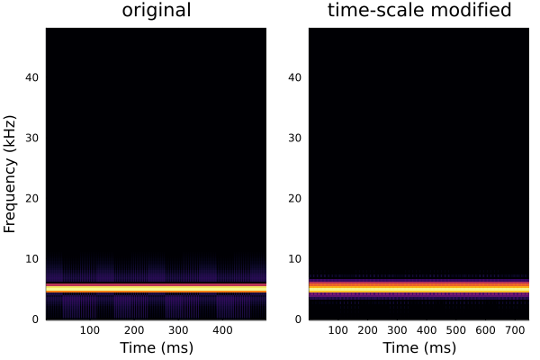
```
plot(signal(x[1:960], fs); legend=true, label="original")
plot!(signal(y[1:960], fs); legend=true, label="time-scale modified")
```
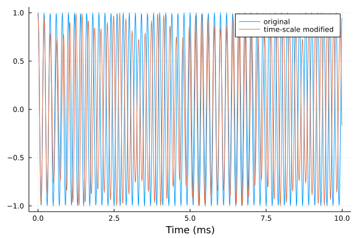
#### Burst signal
```julia
l = @layout [a b]
p1 = specgram(signal(xburst, fs); legend=:none, title="original")
p2 = specgram(signal(yburst, fs); ylabel="", legend=:none, title="time-scale modified")
plot(p1, p2; layout=l)
```
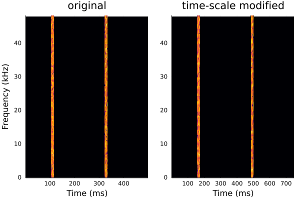
```
plot(signal(xburst, fs); legend=true, label="original")
plot!(signal(yburst, fs); legend=true, label="time-scale modified")
```

### WSOLA
```julia
y = tsmodify(WSOLA(256,128,hanning,10), x, 1.5)
yburst = tsmodify(WSOLA(256,128,hanning,10), xburst, 1.5)
```
#### Sinusoidal signal
```julia
l = @layout [a b]
p1 = specgram(signal(x, fs); legend=:none, title="original")
p2 = specgram(signal(y, fs); ylabel="", legend=:none, title="time-scale modified")
plot(p1, p2; layout=l)
```

```julia
plot(signal(x[1:960], fs); legend=true, label="original")
plot!(signal(y[1:960], fs); legend=true, label="time-scale modified")
```
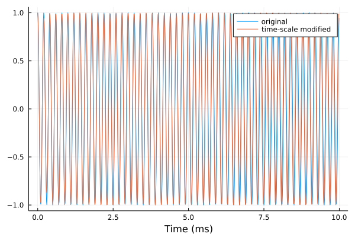
#### Burst signal
```julia
l = @layout [a b]
p1 = specgram(signal(xburst, fs); legend=:none, title="original")
p2 = specgram(signal(yburst, fs); ylabel="", legend=:none, title="time-scale modified")
plot(p1, p2; layout=l)
```
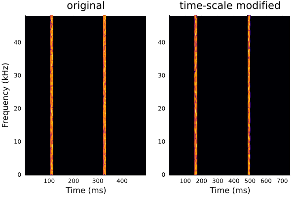
```
plot(signal(xburst, fs); legend=true, label="original")
plot!(signal(yburst, fs); legend=true, label="time-scale modified")
```
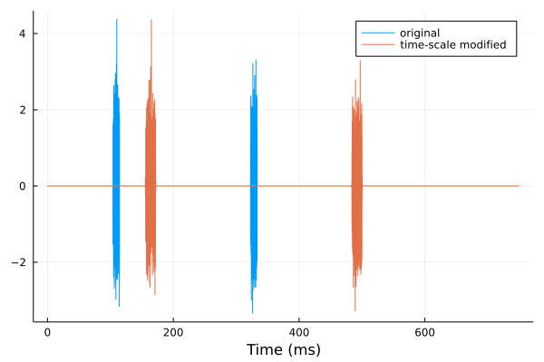

### Phase Vocoder
```julia
y = tsmodify(PhaseVocoder(256,128,hanning,16,false,false,true), x, 1.5)
yburst = tsmodify(PhaseVocoder(256,128,hanning,16,false,false,true), xburst, 1.5)
```
#### Sinusoidal signal
```julia
l = @layout [a b]
p1 = specgram(signal(x, fs); legend=:none, title="original")
p2 = specgram(signal(y, fs); ylabel="", legend=:none, title="time-scale modified")
plot(p1, p2; layout=l)
```
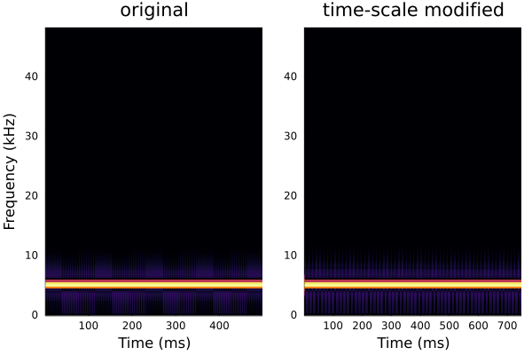
```julia
plot(signal(x[1:960], fs); legend=true, label="original")
plot!(signal(y[1:960], fs); legend=true, label="time-scale modified")
```
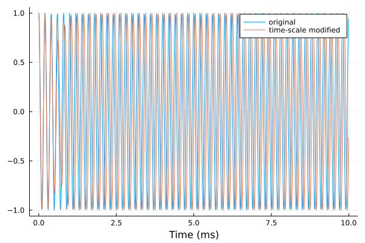
#### Burst signal
```julia
l = @layout [a b]
p1 = specgram(signal(xburst, fs); legend=:none, title="original")
p2 = specgram(signal(yburst, fs); ylabel="", legend=:none, title="time-scale modified")
plot(p1, p2; layout=l)
```
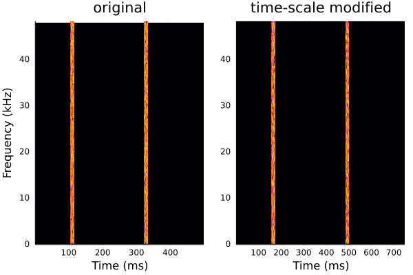
```
plot(signal(xburst, fs); legend=true, label="original")
plot!(signal(yburst, fs); legend=true, label="time-scale modified")
```
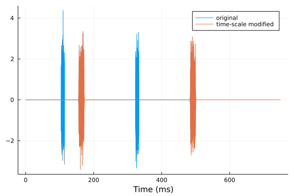

### Pitch shifting
```julia
xps = pitchshift(WSOLA(256,128,hanning,10), x, 6; fs=fs)
l = @layout [a b]
p1 = specgram(signal(x, fs); legend=:none, title="original")
p2 = specgram(signal(xps, fs); ylabel="", legend=:none, title="pitch shifted")
plot(p1, p2; layout=l)
```
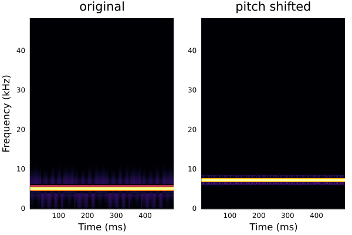

```julia
xps = pitchshift(PhaseVocoder(256,128,hanning,16,false,false,true), x, 6; fs=fs)
l = @layout [a b]
p1 = specgram(signal(x, fs); legend=:none, title="original")
p2 = specgram(signal(xps, fs); ylabel="", legend=:none, title="pitch shifted")
plot(p1, p2; layout=l)
```


## Reference
Driedger J, Müller M., "TSM Toolbox: MATLAB Implementations of Time-Scale Modification Algorithms", In DAFx, pp. 249-256. 2014.