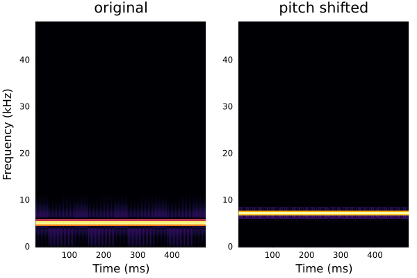

# TimeScaleModification.jl
Time-scale modification for Julia

## Installation

## Usage
```julia
using Plots
using SignalAnalysis
using TimeScaleModification
```
### OLA
```julia
fs = 96000
x = cw(5000, 0.5, fs) |> real |> collect
y = tsmodify(OLA(256,128,hanning), x, 1.5)

l = @layout [a b]
p1 = specgram(signal(x, fs); legend=:none, title="original")
p2 = specgram(signal(y, fs); ylabel="", legend=:none, title="time-scale modified")
plot(p1, p2; layout=l)
```

```
plot(signal(x[1:960], fs); legend=true, label="original")
plot!(signal(y[1:960], fs); legend=true, label="time-scale modified")
```

### WSOLA
```julia
y = tsmodify(WSOLA(256,128,hanning,10), x, 1.5)

l = @layout [a b]
p1 = specgram(signal(x, fs); legend=:none, title="original")
p2 = specgram(signal(y, fs); ylabel="", legend=:none, title="time-scale modified")
plot(p1, p2; layout=l)
```

```julia
plot(signal(x[1:960], fs); legend=true, label="original")
plot!(signal(y[1:960], fs); legend=true, label="time-scale modified")
```


### Pitch shifting
```julia
xps = pitchshift(WSOLA(256,128,hanning,10), x, 6; fs=fs)
l = @layout [a b]
p1 = specgram(signal(x, fs); legend=:none, title="original")
p2 = specgram(signal(xps, fs); ylabel="", legend=:none, title="pitch shifted")
plot(p1, p2; layout=l)
```


## Reference
Driedger J, Müller M., "TSM Toolbox: MATLAB Implementations of Time-Scale Modification Algorithms", In DAFx, pp. 249-256. 2014.